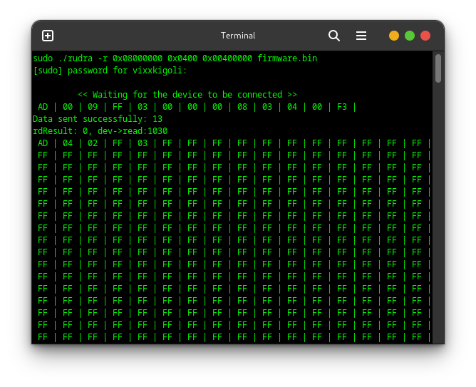
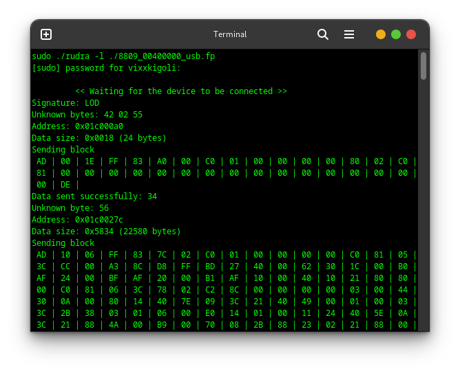
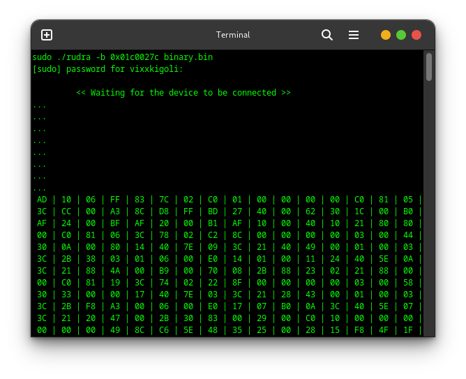
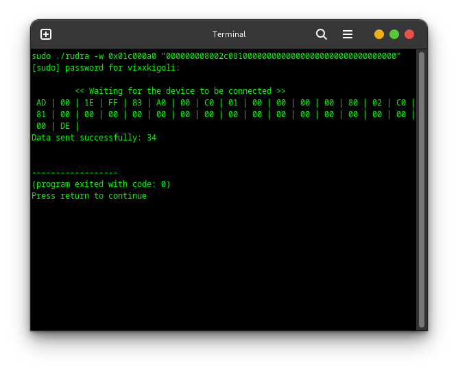

#Project RUDRA: A Firmware Manipulation Tool for RDA Feature Phones
## v 0.1
### Author @vixxxkigoli

## Features of RUDRA
- Dump the firmware from device
- Load a bootloader in device .fp file
- Write a binary file to specified location
- Write a raw data to specified location via terminal

### Note: RUDRA Can't currently flash the firmware, most of the bootloaders are broken, so author is doing research for further scope

# Sceenshot of RUDRA

## Dumping the firmware from device


```bash
sudo ./rudra -r 0x08000000 0x0400 0x00400000 firmware.bin

-r 							: for Read the firmware
0x08000000					: Starting address of firmware
0x0400						: Bytes to read per read Cycle
0x00400000					: Total Capacity of Flash
firmware.bin				: File to store firmware

## Sending the Bootloader

```bash
sudo ./rudra -l ./8809_00400000_usb.fp

-l							: Load the Loader
./8809_00400000_usb.fp		: Bootloader  file in .fp format or LOD

## Sending custome binary file to specified location

```bash
sudo ./rudra -b 0x01c0027c binary.bin

-b							: Load the Binary File
0x01c0027c					: Location to load the binary
./binary.bin				: RAW Binary File

## Sending custome custome RAW data to specified location

```bash
sudo ./rudra -w 0x01c000a0 "000000008002c08100000000000000000000000000000000"

-w							: Write the bytes
"0000**"					: Bytes to send

# How to compile RUDRA

## Prerequsite

We need libusb installed on our system, to install it,
```bash
sudo apt update
sudo apt install libusb-1.0-0-dev
sudo apt install libusb-1.0

## Clone the sources
```bash
git clone https://github.com/vixxkigoli/rudra
cd rudra

## Compile
make

## Run the binary
sudo ./rudra

Read the respective commands carefully

# Where to find respective files and bootloader
## 8809_00400000_usb.fp			: This file is propritary file, so cant share it
## This file is bootloader, you can find these files in flashing tools and Miracle Box or CM2/RDA 
## Installation directory
## binary.bin					: This file is simple raw binary file, you can read firmware and store it
## firmware.bin					: This file will automatically generate while reading firmware

# Changes according to USB Devices
## To change USB Devices vid, pid and other properties
## File: rudra.c
## Function: loadDevProp(USB *dev)
## Prop: dev->vid = 0x1e04; dev->pid = 0x0904;

#License
RUDRA is open-source software, licensed under the GNU General Public. Contributions and suggestions are welcome!

## Hashtags
# RDA Coolsand 8809 

# About USB Device
## lsusb
```bash
lsusb -vd 1e04:0904
Bus 002 Device 010: ID 1e04:0904 Coolsand Technologies Coolsand
Device Descriptor:
  bLength                18
  bDescriptorType         1
  bcdUSB               1.10
  bDeviceClass            0 
  bDeviceSubClass         0 
  bDeviceProtocol         0 
  bMaxPacketSize0        64
  idVendor           0x1e04 
  idProduct          0x0904 
  bcdDevice           34.10
  iManufacturer           1 Coolsand Technologies
  iProduct                2 Coolsand
  iSerial                 3 Host USB
  bNumConfigurations      1
  Configuration Descriptor:
    bLength                 9
    bDescriptorType         2
    wTotalLength       0x0020
    bNumInterfaces          1
    bConfigurationValue     1
    iConfiguration          5 
    bmAttributes         0x00
      (Missing must-be-set bit!)
      (Bus Powered)
    MaxPower              100mA
    Interface Descriptor:
      bLength                 9
      bDescriptorType         4
      bInterfaceNumber        0
      bAlternateSetting       0
      bNumEndpoints           2
      bInterfaceClass       255 Vendor Specific Class
      bInterfaceSubClass    102 
      bInterfaceProtocol    102 
      iInterface              4 
      Endpoint Descriptor:
        bLength                 7
        bDescriptorType         5
        bEndpointAddress     0x81  EP 1 IN
        bmAttributes            2
          Transfer Type            Bulk
          Synch Type               None
          Usage Type               Data
        wMaxPacketSize     0x0040  1x 64 bytes
        bInterval               1
      Endpoint Descriptor:
        bLength                 7
        bDescriptorType         5
        bEndpointAddress     0x01  EP 1 OUT
        bmAttributes            2
          Transfer Type            Bulk
          Synch Type               None
          Usage Type               Data
        wMaxPacketSize     0x0040  1x 64 bytes
        bInterval               1

