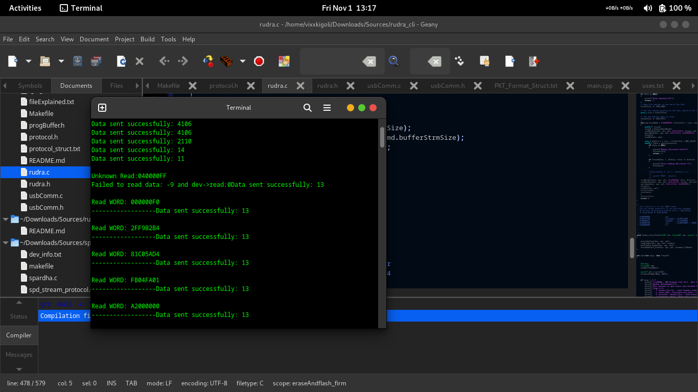

# Project RUDRA: A Firmware Flashing/Dumping Tool for RDA Feature Phones and CPUs
**Version:** 0.3  
**Author:** @vixxxkigoli

## Features of RUDRA
- Dump firmware from device
- Flash the firmware to device
- Load a bootloader in `.fp` format
- Write a binary file to a specified location
- Write raw data to a specified location via terminal
- Test the loader: During tests, LED and Camera Flashlight are triggered

## Screenshots of RUDRA

### Dumping Firmware from Device


```bash
sudo ./rudra -r 0x08000000 0x0400 0x00400000 firmware.bin

# -r                : Command to read firmware
# 0x08000000        : Starting address of firmware
# 0x0400            : Bytes to read per cycle
# 0x00400000        : Total flash capacity (4MB in this example)
# firmware.bin      : File to store firmware
```

## Flashing/Burn the firmware to device
## [How Flashing Work ?](https://github.com/borkarsachin97/rudra/tree/master/loaders)

```bash
sudo ./rudra -f ./loaders/8809_00400000_usb.fp ./firmware.bin
# -f							: Flashing command
# ./8809_00400000_usb.fp		: Bootloader  file in .fp format or LOD
# ./firmware.bin				: Firmware File to Flash
# Note: Do not write wrong firmware, or try to write firmware alike devices
# 		these devices do not allow in "Download Mode" once they executed
#		codes, you'l not able get the USB interface and worse the wrong
# 		firmware will make your device broke, untill you have UART/Jtag
```

## Testing 8809 Loader with Phone

```bash
sudo ./rudra -t ./loaders/8809_00400000_usb.fp

# -t							: test 8809 Loader with CPU
# ./8809_00400000_usb.fp		: Bootloader  file in .fp format or LOD
```

## Sending the Bootloader

```bash
sudo ./rudra -l ./loaders/8809_00400000_usb.fp

# -l							: Load the Loader
# ./8809_00400000_usb.fp		: Bootloader  file in .fp format or LOD
```
## Sending custome binary file to specified location

```bash
sudo ./rudra -b 0x01c0027c binary.bin

# -b							: Load the Binary File
# 0x01c0027c					: Location to load the binary
# ./binary.bin				: RAW Binary File
```
## Sending custome custome RAW data to specified location

```bash
sudo ./rudra -w 0x01c000a0 "000000008002c08100000000000000000000000000000000"

# -w							: Write the bytes
# "0000**"					: Bytes to send
```

# Changelog
```bash
**************01/11/2024************
# Upgrade: v0.3
- Added Firmware Flashing Support
- Added Ping-Pong Buffer Support sfter loader work

**************30/10/2024************
# Upgrade: v0.2
- Added New functions for internal Register manupulation
- Added Support for RDA/Coolsand 8809 loader test
- Added loader files in project, they are from RDA/Coolsand, implemented from CM2
- Fixed Memory leaks
- Fixed binary len_size a bit
************************************
```

# How to compile RUDRA

## Prerequsite

We need libusb installed on our system, to install it,
```bash
sudo apt update
sudo apt install libusb-1.0-0-dev
sudo apt install libusb-1.0
```
## Clone the sources
```bash
git clone https://github.com/borkarsachin97/rudra
cd rudra
```
## Compile
```bash
make
```
## Run the binary
```bash
sudo ./rudra
```
Read the respective commands carefully

# Where to find respective files and bootloader
```bsh
8809_00400000_usb.fp			: This file is propritary file, so cant share it
This file is bootloader, you can find these files in flashing tools and Miracle Box or CM2/RDA 
Installation directory
binary.bin					: This file is simple raw binary file, you can read firmware and store it
firmware.bin					: This file will automatically generate while reading firmware
```
# Changes according to USB Devices
```bash
To change USB Devices vid, pid and other properties
## File: rudra.c
## Function: loadDevProp(USB *dev)
## Prop: dev->vid = 0x1e04; dev->pid = 0x0904;
## If you are  using tty/USB then add codes for detach kernel drivers
```

# License
```bash
RUDRA is open-source software, licensed under the GNU General Public. Contributions and suggestions are welcome!
```

## Hashtags
```bash
# RDA Coolsand 8809 
```

# About USB Device
```bash
lsusb -vd 1e04:0904
Bus 002 Device 010: ID 1e04:0904 Coolsand Technologies Coolsand
Device Descriptor:
  bLength                18
  bDescriptorType         1
  bcdUSB               1.10
  bDeviceClass            0 
  bDeviceSubClass         0 
  bDeviceProtocol         0 
  bMaxPacketSize0        64
  idVendor           0x1e04 
  idProduct          0x0904 
  bcdDevice           34.10
  iManufacturer           1 Coolsand Technologies
  iProduct                2 Coolsand
  iSerial                 3 Host USB
  bNumConfigurations      1
  Configuration Descriptor:
    bLength                 9
    bDescriptorType         2
    wTotalLength       0x0020
    bNumInterfaces          1
    bConfigurationValue     1
    iConfiguration          5 
    bmAttributes         0x00
      (Missing must-be-set bit!)
      (Bus Powered)
    MaxPower              100mA
    Interface Descriptor:
      bLength                 9
      bDescriptorType         4
      bInterfaceNumber        0
      bAlternateSetting       0
      bNumEndpoints           2
      bInterfaceClass       255 Vendor Specific Class
      bInterfaceSubClass    102 
      bInterfaceProtocol    102 
      iInterface              4 
      Endpoint Descriptor:
        bLength                 7
        bDescriptorType         5
        bEndpointAddress     0x81  EP 1 IN
        bmAttributes            2
          Transfer Type            Bulk
          Synch Type               None
          Usage Type               Data
        wMaxPacketSize     0x0040  1x 64 bytes
        bInterval               1
      Endpoint Descriptor:
        bLength                 7
        bDescriptorType         5
        bEndpointAddress     0x01  EP 1 OUT
        bmAttributes            2
          Transfer Type            Bulk
          Synch Type               None
          Usage Type               Data
        wMaxPacketSize     0x0040  1x 64 bytes
        bInterval               1
```
